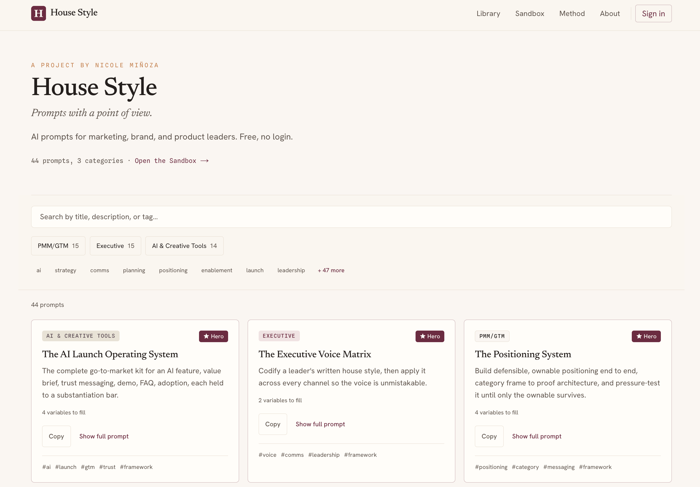

# House Style

**Prompts with a point of view.** A curated AI workflow product for marketing, brand, and product leaders who want better output than generic prompt libraries.

**Try it:** [housestyle.nicoleminoza.com](https://housestyle.nicoleminoza.com) · **Status:** pre-launch

## The product, and why

**For:** marketing, brand, and product leaders who already use AI and keep getting generic output.

**Insight:** the problem is usually the brief, not the model. Most prompt libraries are long lists of one-line requests with no judgment about what good looks like. House Style prompts are written the way a senior leader briefs a strong team member: a clear job, the inputs that matter, and a quality bar the output has to meet.

**Positioning:** small and curated, where most collections are large and unfiltered. Every prompt is here for a reason.

## What the product includes

- **PMM/GTM (15):** positioning, messaging, launch tiering, competitive and win/loss work
- **Executive (15):** decision memos, board updates, strategy on a page, change communication
- **AI & Creative Tools (14):** AI launch messaging, trust and safety, adoption, output-quality rubrics

Three flagship prompts are full frameworks rather than single tasks: the **AI Launch Operating System**, the **Executive Voice Matrix**, and the **Positioning System**.

## Product and growth decisions

Each decision is a bet, with the signal that will confirm or reject it.

| Bet | Decision | Signal |
|---|---|---|
| The first use has to be a win, or people won't come back. | Every prompt is free to read and copy, with no account. | Copies per visitor; return visits |
| People will sign in for a tool, not for content. | Sign-in saves filled prompts and unlocks interactive builders for the three flagship frameworks. Nothing in the library is held back. | Sign-up rate from builder pages |
| Variables are where prompts fail. | A sandbox (`/demo`) lets people fill in a prompt's variables before copying. | Sandbox completions vs. direct copies |
| Curation beats volume. | 44 prompts, each reviewed against a written method ([/method](https://housestyle.nicoleminoza.com/method)). | Share of copies going to the top 10 prompts |

PostHog tracks active users, sign-ups and copy events from day one, so every signal above is measurable at launch.

## What I’m testing

Whether a smaller, opinionated library drives more repeat use than a large generic collection; whether utility earns sign-in better than content gating; and whether interactive builders improve completion on the highest-value workflows.

## How it was built

Built solo by directing Claude Code across product requirements, prompt curation, information architecture, and technical trade-offs. The stack uses Next.js, Supabase, and PostHog; every prompt addition or removal is treated as a product decision, not a content update.

Setup, architecture and routes are in [`DEVELOPMENT.md`](DEVELOPMENT.md).

## Author

[Nicole Miñoza](https://nicoleminoza.com), product and product marketing leader; former Adobe Director of Product Management.
